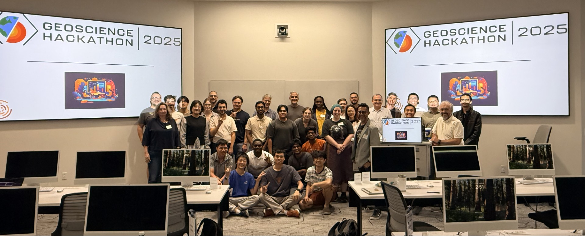

The first Geoscience Hackathon, organized by the Jackson School of Geosciences and the Open-Souce Program Office at the University of Texas at Austin, took place on **October 4-6, 2024** at the Scholars Lab of the Perry-Castañeda Library. ConocoPhillips and Sandia National Labs sponsored the event. 

The theme of the hackathon was computational reproducibility. Around 20 students split into teams and worked on creative projects reproducing and extending computational results from previously published classic geoscience papers.

A panel of external judges evaluated the results. 

# Projects

**Team Surfers** 
- **1st Place Award**
- Members: Neelarun Mukherjee, Amber Nguyen, and Akshika Rohatgi
- Mentor: Yangkang Chen
- Reproduced paper: Physics-informed neural networks: A deep learning framework for solving forward and inverse problems involving nonlinear partial differential equations (Raissi et al., 2019)
- Repository: https://github.com/arohatgi29/Team_Surfers_Geoscience_Hackathon2024

**Team PINN Wheels**
- Members: Ahmed-Wassim Benzerga, Mateo Garcia-Rosell, and Willow Stenglein
- Mentor: Manmeet Singh
- Reproduced paper: Physics-informed neural networks: A deep learning framework for solving forward and inverse problems involving nonlinear partial differential equations (Raissi et al., 2019)
- Repository: https://github.com/wxssbxss0/Geoscience-Hackathon-Fall-24

**Team Texas Texture Testers**
- Members: Riley Foster, Juan Gutiérrez, and Olivia Wachob
- Mentor: Zoltán Sylvester
- Reproduced papers:  Influence of texture on porosity and permeability of unconsolidated sand (Beard and Weyl, 1973), Quantitative textural analysis (Taylor et al., 2022)
- Repository: https://github.com/owachob/grain_analyzer

**Team GLT4**
- **2nd Place Award**
- Members: Zulkuf Azizoglu, Fehmi Özbayrak, and Çınar Turhan
- Mentor: Zoltán Sylvester
- Reproduced papers:  Influence of texture on porosity and permeability of unconsolidated sand (Beard and Weyl, 1973), Quantitative textural analysis (Taylor et al., 2022)
- Repository: https://github.com/fozba/glt4_geoscience_hackathon

**Team Well Logged**
- Members: Leena Abdulqader, Mariah Gardner, Matheos Giakoumi, Gabriel Ojo, and Manav Patel
- Mentors: Brendon Hall and Ben Lasscock
- Reproduced papers: Scale-space filtering (Witkin, 1987), Improving automated geological logging of drill holes by incorporating multiscale spatial methods (Hill et al., 2021)
- Repository: https://github.com/brendonhall/blockhead

**Team SoundFX** 
- **Audience Choice Award**
- Members: Héctor Antonio Corzo Pola and Sujith Swaminadhan
- Mentor: Sergey Fomel 
- Reproduced papers: Seismic trace interpolation in the FX domain (Spitz, 1991), Comparisons of interpolation methods (Abma and Kabir, 2005)
- Repository: https://github.com/ahay/src/tree/master/book/hackathon/soundfx2024

# Judges

- Victor Eijkhout (Texas Advanced Computing Center)
- Troy Hawkes (Chevron)
- Zhengxue Li (ConocoPhillips)
- Nadine Miner (Sandia National Labs)
